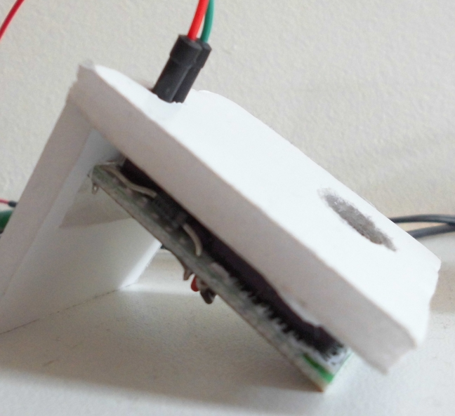
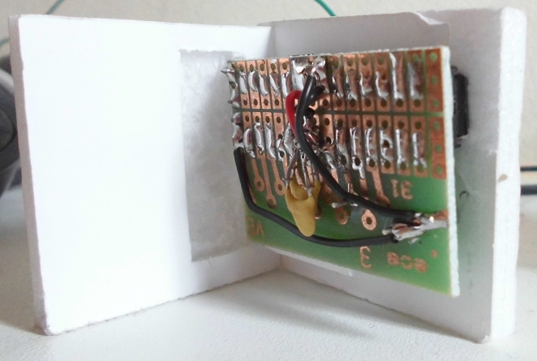

# MinimalPiClock

The MinimalPiClock is [one of my machines](https://github.com/richelbilderbeek/Machines) that uses Arduino.

It's an Arduino project for a clock that beeps at pi o'clock PM.

## How to set the time

Unplug its power. Plug it in at midnight.

## How to read the time

You cannot. It only beeps at pi o'clock.

## Minimal PiClock 

