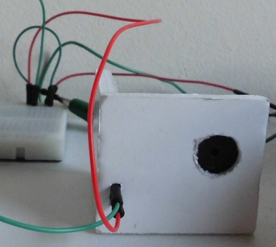
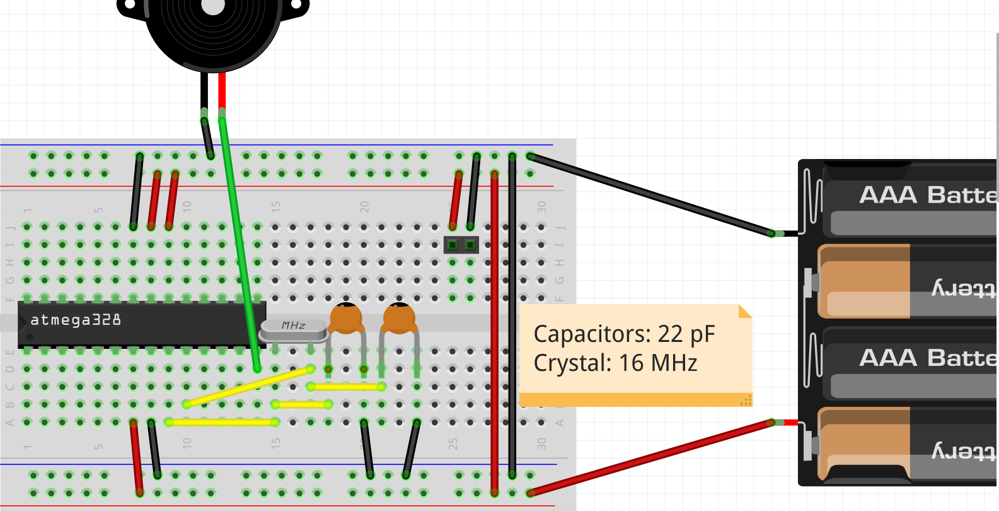

# MinimalPiClock

Branch|
---|---
`master`|

The MinimalPiClock is [one of my machines](https://github.com/richelbilderbeek/Machines) that uses Arduino.

It's an Arduino project for a clock that beeps at pi o'clock PM.

## FAQ

### How to set the time

Unplug its power. Plug it in at midnight.

### How to read the time

You cannot. It only beeps at pi o'clock PM (thus 15:14).

### Can the MinimalPiClock be powered by USB?

Yes.

### Can the MinimalPiClock be powered by a 5V DC adapter?

Yes.

## Can the MinimalPiClock be powered by 3x AAA batteries?

Yes.

## Can the MinimalPiClock be powered by 4x AAA batteries?

Yes.

## How expensive is the MinimalPiClock?

About ten euros in total.

## Can I make a MinimalPiClock myself?

Yes, it is rather easy. All schematics and code are on this GitHub.

## Will you make a MinimalPiClock for me?

No. But I can help. Or try your local hacker- or makerspace.

## Do you think using an ATMEGA328 chip is overkill here?

Yes.

## Where do I download the `Time` library?

Here: [https://github.com/PaulStoffregen/Time](https://github.com/PaulStoffregen/Time)
