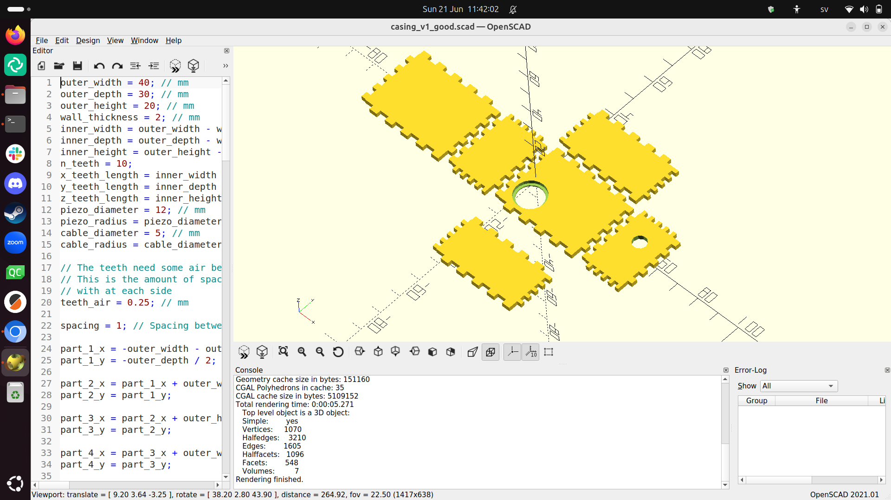
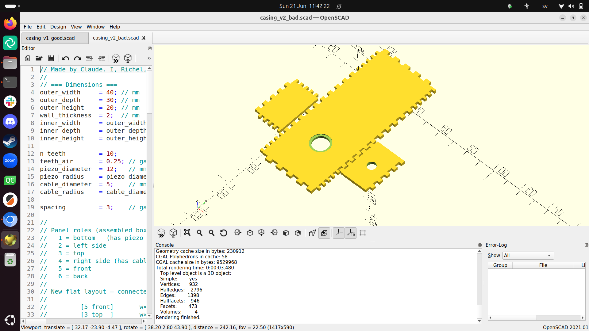
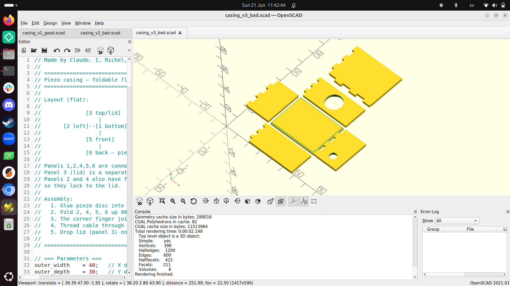
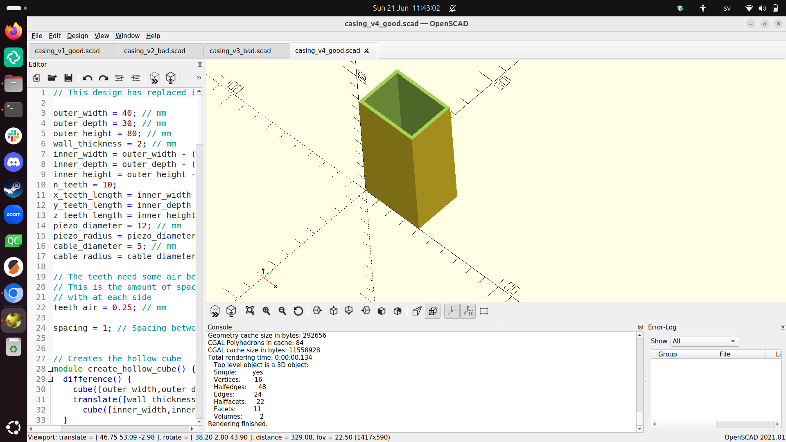
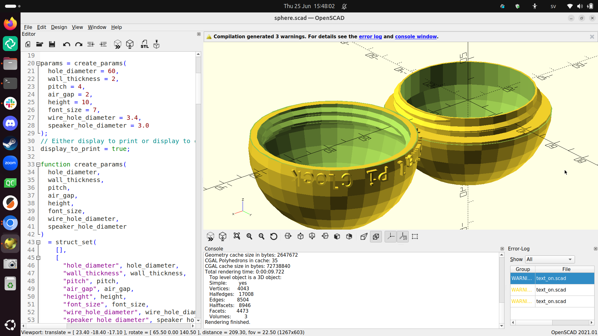

# Casing's history

Here is the history of [the casing](README.md)
used in this machine.

## Six pieces box

The 'six pieces box' was my first idea
and my first real casing design, in OpenSCAD:

- [six_pieces_box.scad](six_pieces_box.scad)

I wanted a design without scaffolding, hence I opted
to glue to pieces together.

However, I was unhappy with this design, as it involved too much glue
and the glue available to me was not strong enough.

I realized that
I can instead go for an open box design, where only a
lid needs to be conneced to the box-except-lid.
I decided to transition to this two pieces box design.

## Two pieces box

Instead of glueing together the six pieces,
I realized I could print 5 out of 6 pieces as one single piece
without scaffolding.

I first tried to create such a two pieces box
using Claude. It did not work out well:

- [transition_1.scad](transition_1.scad)

- [transition_2.scad](transition_2.scad)

Realizing Claude does not understand OpenSCAD well enough,
I designed part of this design hand instead.

- [two_pieces_box.scad](two_pieces_box.scad)

However, how to connect the lid?

I decided to start using a screw-on approach. Then, I realized,
that I might as well make the clock spherical: it fits the theme better.

This is how I landed on the final design.

## Sphere

A spherical design for a pi clock felt like a good fit.
I wanted to have the sphere consists out of two half-spheres
that can be screwed together.

It worked great!

My first design had a structural weakness:
the ring that connected the bolt with the outer sphere
was too thin and needed scaffolding.

I decided to make both the bolt and nut to extend down/up the entire
half-sphere, making it sturdier and reduce scaffolds.

