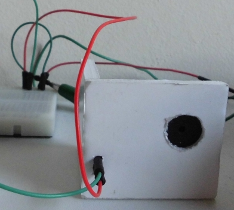
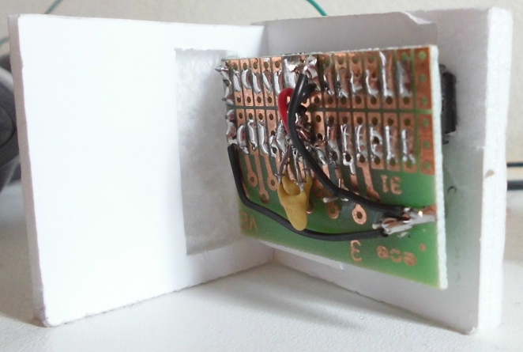
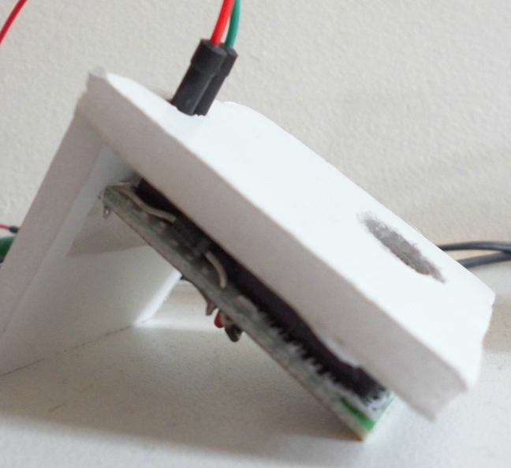
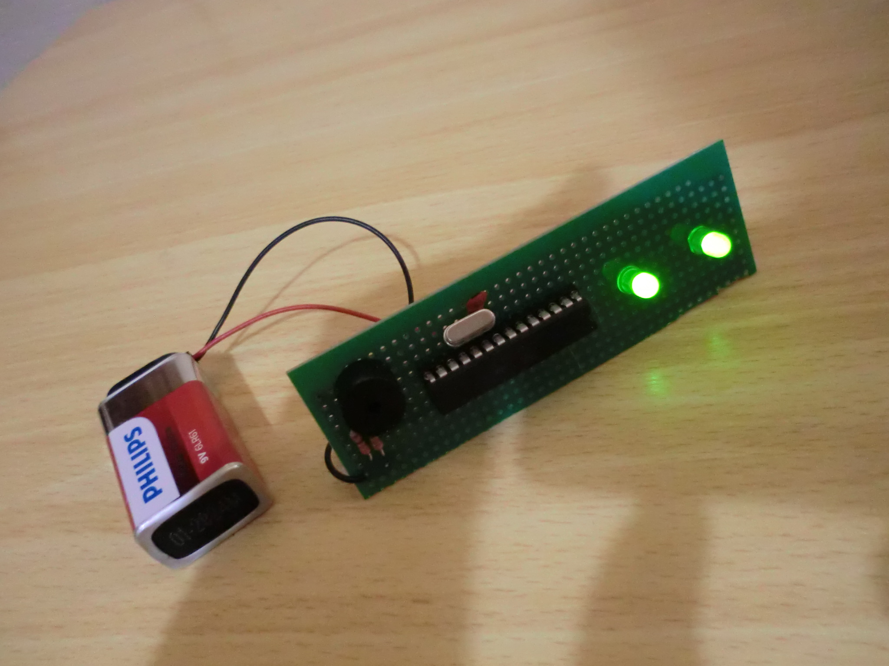
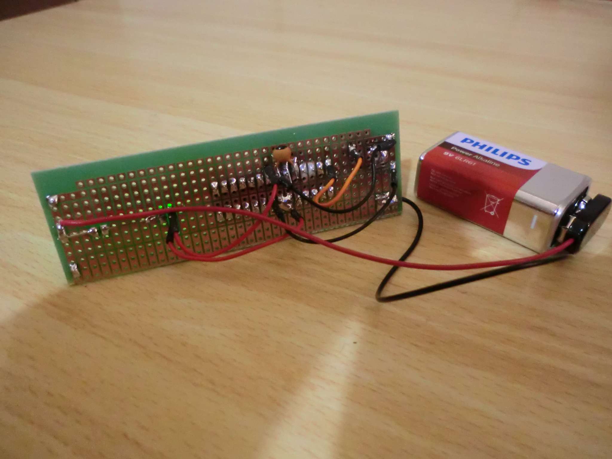
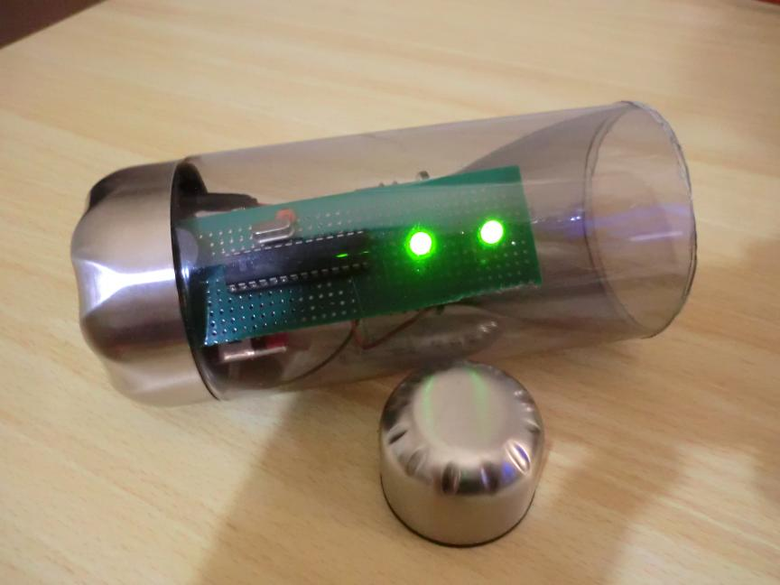
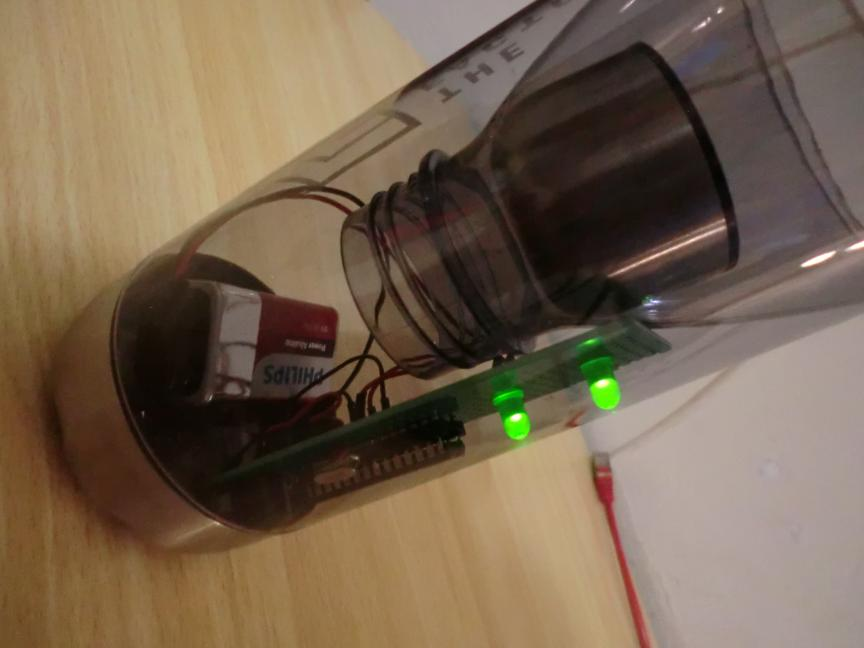
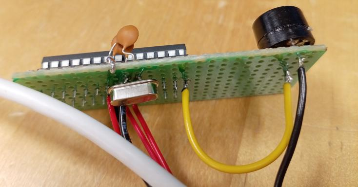
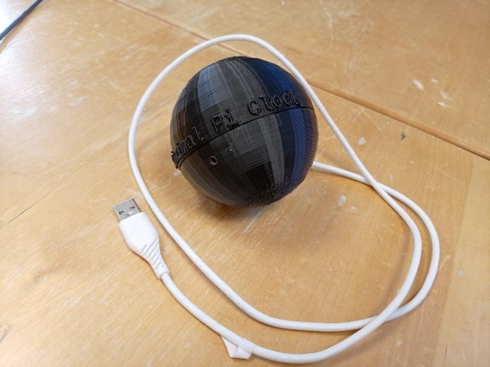

# Minimal Pi Clock pictures

The Minimal Pi Clock can look many different ways.

## 2017

> Minimal Pi Clock, front view. The machine was powered by the Arduino
> 5V and GND pins.

> Minimal Pi Clock, back view

> Minimal Pi Clock, side view

## 2019

> PCB is ready, front view

> PCB is ready, back view

> Minimal Pi Clock, front view

> Minimal Pi Clock, back view

## 2026

> PCB is ready, front view

> PCB is ready, back view

> Minimal Pi Clock with spherical casing v0.2
