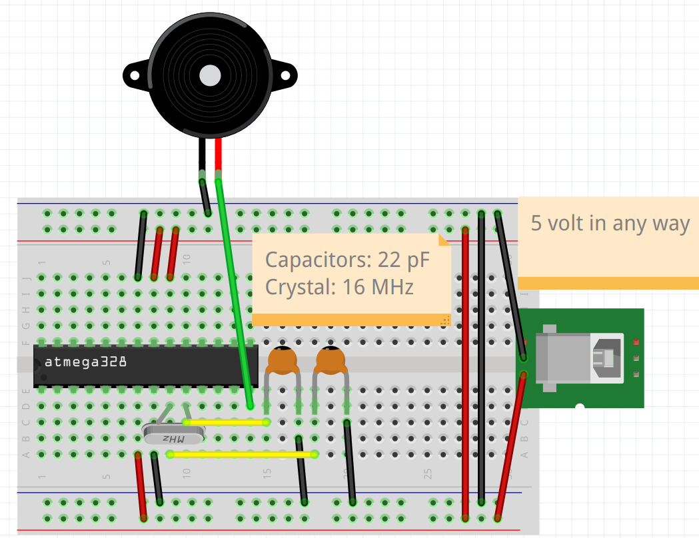
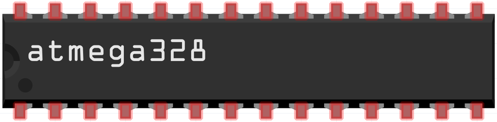

# Schematics

- [The Fritzing file](minimal_pi_clock.fzz)

Build the schematic as such,
using the chip with The Minimal Pi Clock
program on it. 

??? question "In which orientation must I have the chip?"

    The notch of the chip must be at the left:

    

    > The notch of the chip must be at the left.

??? question "Can you show the wiring of the chip as a table?"

    Yes.

    Here is an equivalent table:

    Pin  |1  |2  |3  |4  |5  |6  |7  |8  |9  |10 |11 |12 |13 |14
    -----|---|---|---|---|---|---|---|---|---|---|---|---|---|---
    Upper|.  |.  |.  |.  |.  |.  |GND|5V |5V |.  |.  |.  |.  |.
    Lower|.  |.  |.  |.  |.  |.  |5V |GND|X1 |X2 |.  |.  |.  |P

    - `GND`: to ground
    - `5V`: to 5 volt
    - `X1`: to a capacitor and crystal
    - `X2`: to (another) capacitor and (the same) crystal
    - `P`: to plus of piezo

??? question "What does '5 Volts in any way' mean?"

    Where the schematic states '5 Volts in any way',
    this means any reasonable way to provide 5 volts
    for the machine.

    In this example, a USB-B female is shown,
    but any USB connector can be used.

??? question "Can I use other electric potenials than 5V?"

    Yes.

    The range of the chip is wider than 5 volts.

Upon powering this, the buzzer fill go off for
a little more than three seconds.
